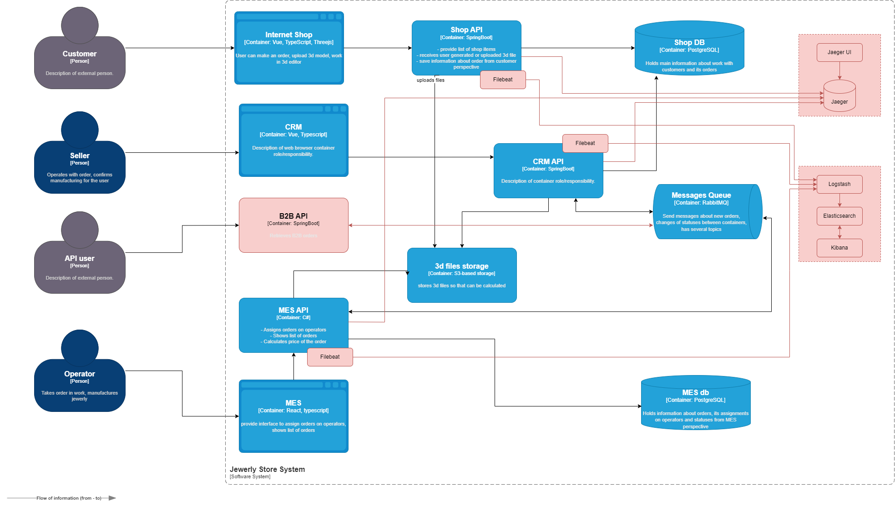

# Архитектурное решение по логированию

Схема в формате drawio находится в корне репозитория.

### Общее описание 

Сейчас ошибки или нестандартные ситуации разбираются со слов клиента: клиенты рассказывают, как что-то пошло не так. Чтобы понять, что случилось, разработчикам и специалистам поддержки требуется очень много времени.
Планируется настройка структурного логирования во всех основных подсистемах: CRM, MES, онлайн-магазина.

Основные логи `INFORMATION` уровня
- события создания заказа
- все события изменения статуса заказа
- события создания/редактирования/удаления пользователей

Также в следует добавить логирование всех исключений в подсистемах (ошибки логики, ошибки сети, ошибки БД и т.д)

В целом при добавлении логирования предлагается руководствоваться общепринятыми уровнями:
- `FATAL` — отказ сервиса или оборудования, либо события, приводящие к таковому.
- `ERROR` — ошибочное состояние. Например, «Пользователь заблокирован». Также сюда относятся все сетевые, инфраструктурные ошибки, ошибки БД и очереди сообений.
- `WARNING` — состояние, которое близко к нестандартному поведению системы. Например, «Пользователь неправильно ввёл пароль». В зависимости от контекста сюда можно отнести обрабатываемые ошибки.
- `INFORMATION` — это штатное поведение. Такие логи обычно используют для записи обычных сообщений. Например, «Данные загружены». К этому уровню относятся основные бизнес-операции.
- `DEBUG` обычно используют для отладки. На продакшн-серверах их не используют, чтобы не засорять логи лишней информацией. В зависимости от контекста и на усмотрение разработчика.
- `TRACE` обычно используют в среде разработки и для отладки в тестовом окружении. В зависимости от контекста и на усмотрение разработчика.

### Мотивация

- ускорение исправления дефектов, как следствие уменьшение бизнес-потерь и повышение лояльности клиентов
- значительное упрощение отладки, как следствие быстрое решение проблем пользователей
- возможность значительного расширения мониторинга на основе логируемых событий

Наиболее приоритетным сейчас видится повышение стабильности работы сиситемы, поэтому в первую очередь логирование и трейсинг будет добавлено в наименее стабильные части системы. Сейчас таковыми видятся (в порядке приоритета): CRM, MES, онлайн-магазин.
В среднесрочной перспективе логированию и трейсингу подлежат все значимые части системы.

### Предлагаемое решение

В сиситеме используются крайне популярные технологии - Java SpringBoot и .net, предлагающие широчайшие возможности для логирования, в т.ч. структурного. На первых порах предлагается простая запись в файлы с их периодическим архивированием и ручным копированием в отдельное архивное хранилище.

Запрещается запись в лог чувствительных данных например паролей, токенов доступа и т.д. Также запрещается запись в лог персональных данных пользователей, допускается только запись в виде идентификаторов.
Доступ к файлам логов возможен только для администраторов.

Впоследствии планируется внедрение полноценного ELK-стека с отправкой логов с помощью FileBeat. Время хранения и объем логов будут определены позднее. Предварительно время хранения логов - 1 месяц (немного больше, чем время выполнения заказа). Индексы целесообразно разделить по подсиситемам.
Доступ к ELK возможен только для авторизованных пользователей системы с соответствующей ролью.

### Мероприятия для построения системы анализа логов

Видится целесообразной настройка алертинга для следующего аномального поведения системы:
- частота создания заказов
- общая активность пользователей
- частота ошибок
- динамика роста числа сущностей в системе / записей в БД / сообщений в очереди